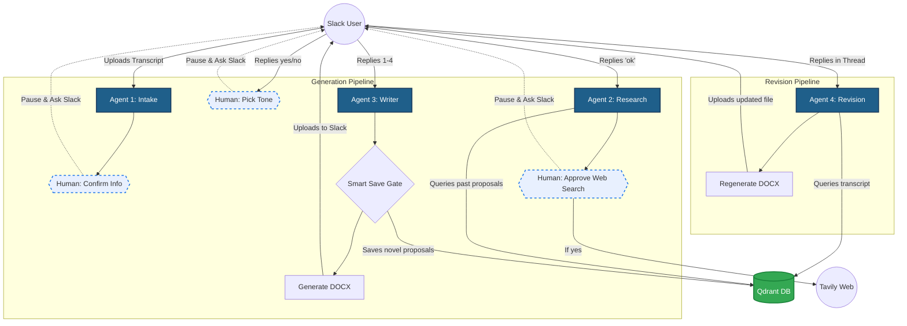

# Slack AI Proposal Generator

A multi-agent AI system that automatically generates professional business proposals from sales call transcripts. Built with LangGraph, FastAPI, Qdrant, and Slack Bolt.

## Features

- **Multi-Agent Pipeline:** 4 specialized agents (Intake, Research, Writer, Revision) working together.
- **Human-in-the-Loop:** Pauses at key decision points for user confirmation (intake extraction, web search approval, tone selection).
- **Self-Learning RAG:** Automatically saves novel generated proposals back to Qdrant to improve future context.
- **Smart Save Gate:** Deduplicates proposals before saving to keep the vector database clean (skips if similarity > 0.85).
- **Web Search Fallback:** Uses Tavily API to search the internet if the internal knowledge base lacks context. Runs asynchronously in a background thread to prevent event loop blocking.
- **Zero-Docker Qdrant Fallback:** Automatically falls back to a disk-based Qdrant client (`data/qdrant_db`) if no Docker instance of Qdrant is running.
- **Thread Isolation & Link Mapping:** Resolves Slack's nested thread constraints by linking document file shares directly to original database sessions while isolating thread messages to prevent cross-wiring.
- **Cross-Session Memory:** Remembers transcripts and drafts via an SQLite session store, even if the user returns days later.
- **Surgical Revisions:** Asks follow-up questions and specifically edits single sections of the document without rewriting the entire proposal.
- **DOCX Generation:** Converts the final Markdown draft into a styled, professional Word document.

---

## 🏗 Architecture Overview

The system uses a stateful LangGraph pipeline (`ProposalState`) across two distinct graphs.



### 🧩 Detailed Node Architecture

#### Graph A: Initial Generation Pipeline
1. **`intake_node` (Intake Agent):**
   - Extracts structured details from the client transcript (Company, Industry, Goals, Budget, Timeline, Stakeholders).
   - **HITL Interrupt:** Pauses execution and posts the summary to Slack, waiting for the user to confirm (`ok` or edit info).
2. **`research_node` (Research Agent):**
   - Embeds the query and filters Qdrant past proposals by industry.
   - If the similarity is `< 0.45`, it triggers a **HITL Interrupt** asking if the user would like to search the internet for context.
   - If approved, it calls Tavily Web Search asynchronously and appends results to the context.
3. **`tone_node`:**
   - **HITL Interrupt:** Pauses and asks the user to select the document's tone (1: Formal, 2: Technical, 3: Consultative, 4: Industry Default).
4. **`writer_node` (Writer Agent):**
   - Synthesizes all gathered information, writes the markdown draft, generates a formatted `.docx` file, and routes to Qdrant via a **Smart Save Gate** (checks similarity against database; skips saving if > 0.85 to avoid duplicate embedding).

#### Graph B: Revision Pipeline
1. **`revision_node` (Revision Agent):**
   - Triggered on any threaded replies to a complete proposal.
   - Uses an LLM classifier to determine if the message is a **Question** or an **Edit**.
   - **If Question:** Performs RAG on the call transcript in Qdrant and replies with the specific answer.
   - **If Edit:** Extracts the targeted proposal section, edits only that section, merges it back, regenerates/uploads the updated `.docx` file, and saves the new draft to SQLite to preserve changes for future revisions.

*For an in-depth breakdown of technical decisions, see [docs/decision_doc.md](docs/decision_doc.md).*

---

## 🚀 Quickstart Guide

### Prerequisites

- Python 3.12+
- Docker (Optional: Qdrant will automatically fall back to local disk-based storage if Docker is not running)
- A Slack Workspace with an installed App (requires Bot Token and Signing Secret)
- API Keys: Groq (LLM) and Tavily (Web Search)

### 1. Clone & Setup Environment

```bash
git clone https://github.com/raotalha71/Slack-bot.git
cd Slack-bot

# Create and activate virtual environment
python3.12 -m venv --copies venv
source venv/bin/activate

# Install dependencies
pip install -r requirements.txt
```

### 2. Configure Environment Variables

```bash
cp .env.example .env
```
Edit `.env` and add your keys:
- `GROQ_API_KEY`: Get from [Groq Console](https://console.groq.com/)
- `TAVILY_API_KEY`: Get from [Tavily](https://tavily.com/)
- `SLACK_BOT_TOKEN`: Starts with `xoxb-...`
- `SLACK_SIGNING_SECRET`: Get from Slack App Basic Information

### 3. Start Infrastructure
* **Option A (Docker - Recommended):** Run Qdrant using Docker Compose:
  ```bash
  docker-compose up -d qdrant
  ```
* **Option B (Container-Free):** Simply skip Docker. The app will automatically connect to a disk-based Qdrant client stored at `./data/qdrant_db`.

### 4. Run the Application

```bash
uvicorn main:api --reload --port 8000
```

On startup, the app will:
1. Initialize the SQLite database.
2. Connect to Qdrant.
3. Automatically download the embedding model (`all-MiniLM-L6-v2`).
4. Ingest the seed proposals from `seed_data/` into Qdrant.

### 5. Connect Slack (Tunneling)

Since Slack needs a public HTTPS URL to deliver events, use `localtunnel` or `ngrok` to expose your local server:

* **Using localtunnel:**
  ```bash
  npx localtunnel --port 8000
  ```
* **Using ngrok:**
  ```bash
  ngrok http 8000
  ```

Copy the generated forwarding URL and:
1. Go to your Slack App configuration -> **Event Subscriptions**.
2. Enable Events and paste the URL: `https://<your-tunnel-url>/slack/events`.
3. Subscribe to bot events: `file_shared`, `message.channels`, `message.im`.

---

## 🛠 How to Use the Bot

1. **Start a Generation:** Upload a `.txt` or `.md` transcript file directly to the Slack channel where the bot is invited.
2. **Confirm Extraction:** The bot will reply in a thread with extracted info. Reply `ok` or specify corrections.
3. **Handle Fallbacks:** If the bot doesn't find relevant past proposals, it will ask if you want to search the web. Reply `yes` or `no`.
4. **Select Tone:** Reply with a number (1-4) to choose the proposal tone.
5. **Review DOCX:** The bot will generate and upload the final `.docx` proposal.
6. **Revise:** Reply in the thread to ask questions (`What was their budget?`) or request edits (`Change the timeline section to be 6 months`). You can also reply directly to the `.docx` file share block to ask questions or suggest revisions.

---

## 📁 Repository Structure

```text
Slack-bot/
├── app/
│   ├── agents/          # LangGraph agents (Intake, Research, Writer, Revision)
│   ├── models/          # Pydantic schemas and TypedDict state
│   ├── rag/             # Qdrant integration, chunking, and ingestion
│   ├── services/        # Orchestration layer (ProposalService)
│   ├── slack/           # Slack event handlers and bolt app
│   └── tools/           # Web search (Tavily) and DOCX generation
├── data/                # SQLite database (auto-created sessions & checkpoints)
├── docs/                # Architecture decision document
├── scripts/             # Standalone scripts (seed ingestion)
├── seed_data/           # Assessment-provided sample proposals and test files
├── .env.example         # Environment variable template
├── docker-compose.yml   # Infrastructure setup
├── main.py              # FastAPI entry point
└── requirements.txt     # Python dependencies
```